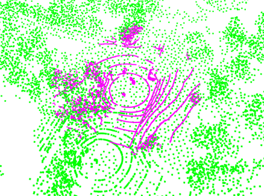
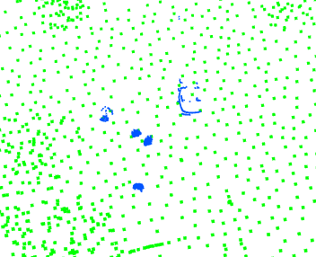
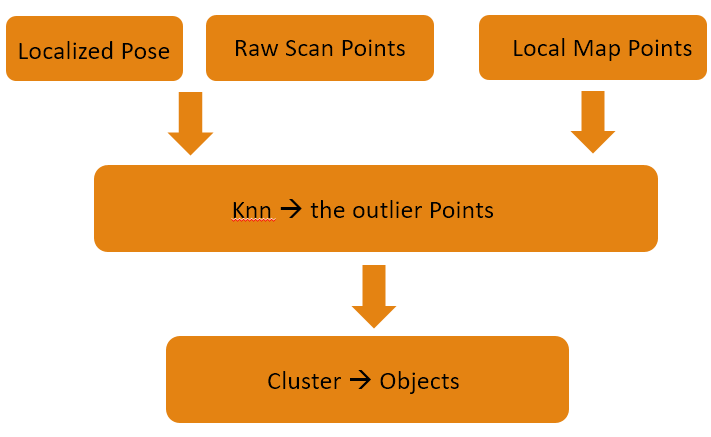

## INPUT DATA

+ use the localization result in the submap of Laser T&R
+ and the submap, and a raw scan of VLP16

## PROCESS

+ use the kdtree to remove the background, keep the dynamic ojects(people, cars, etc) on.
+ Cluster on the objects.

## Results

+ laserScan on the subMap:

+ Use Knn to get the outliers:

+ the cluster results:

+ Process:

## PROBLEM

+ There is problem in the clustering algorithm. 
+ Maybe the true EMST is really needed.
+ Many of cluster methods are waiting for me! 

## Thanks

+ Thanks to Oxford Robotics Institue

  > Wang, Dominic Zeng, Ingmar Posner, and Paul Newman. ["What could move? finding cars, pedestrians and bicyclists in 3d laser data."](http://www.robots.ox.ac.uk/~mobile/Papers/2012ICRA_wang.pdf) *Robotics and Automation (ICRA), 2012 IEEE International Conference on*. IEEE, 2012.

+ and ETHZ_ASL's libs:
  + libpointmatcher:   https://github.com/ethz-asl/libpointmatcher
  + libnabo:   https://github.com/ethz-asl/libnabo